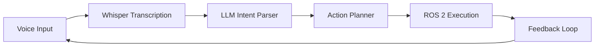

import LearningObjectives from '@site/src/components/LearningObjectives';
import DurationEstimator from '@site/src/components/DurationEstimator';

<LearningObjectives objectives={[
  'Implement voice command capture using Whisper-based systems',
  'Understand the process of intent parsing with large language models',
  'Explain how voice commands are converted to robotic action sequences',
  'Identify the integration points between speech recognition and ROS 2 action execution'
]} />

<DurationEstimator minutes={30} activity="reading" />

# Voice-to-Action Pipeline: Whisper-Based Command Capture and Intent Parsing

## Introduction

The voice-to-action pipeline represents a crucial component of Vision-Language-Action (VLA) systems, enabling natural human-robot interaction through spoken commands. This chapter explores the process of capturing voice commands using Whisper-based systems, parsing user intent with large language models (LLMs), and converting these intentions into executable robotic action sequences.

The voice-to-action pipeline transforms natural language commands from human users into actionable tasks for robotic systems. This transformation involves several stages: speech recognition, natural language understanding, intent extraction, and action mapping.

## Voice Command Capture with Whisper

### Introduction to Whisper

Whisper is OpenAI's automatic speech recognition (ASR) system trained on a large dataset of diverse audio. It's particularly effective for robotics applications due to its robustness to background noise, support for multiple languages, and high accuracy across different accents and environments.

Whisper operates by converting audio input into text transcripts with high fidelity. For robotics applications, this provides a reliable foundation that students can build upon without getting bogged down in speech recognition details.

### Whisper Integration in VLA Systems

In VLA systems, Whisper serves as the voice input processor that converts spoken commands into text for subsequent processing:

```typescript
// Example Whisper integration in a VLA system (conceptual)
interface VoiceProcessor {
  processAudio(audioBuffer: ArrayBuffer): Promise<string>;
  transcribe(filePath: string): Promise<string>;
}
```

Key advantages of Whisper for robotics applications:
- **High accuracy**: Across different accents and environments
- **Robustness**: Functions well in noisy environments
- **Multilingual**: Supports multiple languages
- **Open-source**: Available for research and educational purposes

### Whisper Configuration for Robotics

When configuring Whisper for robotics applications, several parameters require adjustment:
- **Model selection**: Choose between tiny, base, small, medium, large based on computational requirements
- **Language specificity**: Optimizing for domain-specific vocabulary
- **Real-time vs. batch processing**: Determining processing requirements

## Natural Language Understanding and Intent Parsing

### The Role of LLMs in Intent Parsing

Once voice commands are converted to text via Whisper, large language models (LLMs) process the natural language to understand user intent. LLMs excel at understanding intent, context, and ambiguity in human commands, making them ideal for teaching cognitive planning concepts.

The intent parsing process involves several steps:
1. **Command identification**: Identifying the primary action requested
2. **Entity extraction**: Identifying objects, locations, or parameters mentioned
3. **Context interpretation**: Understanding the environmental context of the command
4. **Action mapping**: Connecting the understood intent to available robotic actions

### Techniques for Intent Parsing

#### Prompt Engineering for Intent Extraction

Effective intent parsing relies on well-crafted prompts that guide LLMs to extract structured information:

```
You are a semantic parser for a robotics system. Convert the following user command into structured JSON:

Command: "[USER COMMAND]"

Response in this exact JSON format:
{
  "action": "action_name",
  "target_objects": ["obj1", "obj2"],
  "location": {"x": number, "y": number, "z": number},
  "parameters": {},
  "confidence": 0.0-1.0
}
```

#### Few-Shot Learning Examples

LLMs can be guided through example-based learning to better understand the structure needed:

```
Example 1:
Command: "Pick up the red ball near the table"
{
  "action": "grasp_object",
  "target_objects": ["red ball"],
  "location": {"x": 1.2, "y": 0.5, "z": 0.0},
  "parameters": {"approach_direction": "top"},
  "confidence": 0.85
}

Example 2:
Command: "Navigate to the kitchen and wait there"
{
  "action": "navigate_and_wait",
  "target_objects": [],
  "location": {"x": 3.0, "y": 4.2, "z": 0.0},
  "parameters": {},
  "confidence": 0.92
}
```

## Voice-to-Action Pipeline Architecture

### The Complete Pipeline

The full voice-to-action pipeline consists of the following stages:

1. **Voice Input**: Speech recognition using Whisper or similar systems
2. **Intent Parsing**: Natural language understanding with LLMs
3. **Plan Generation**: Converting intentions into executable robotic tasks
4. **Action Sequencing**: Organizing tasks into time-ordered sequences
5. **ROS 2 Execution**: Converting high-level tasks into ROS 2 action calls

### Integration with ROS 2

The voice-to-action pipeline integrates with ROS 2 through several interfaces:

- **Action Clients**: For long-running tasks like navigation and manipulation
- **Service Calls**: For state queries and configuration changes
- **Topic Messages**: For sending parsed commands and receiving feedback
- **Message Types**: Standardized message formats for intent transfer

## Challenges and Considerations

### Managing Ambiguity

Natural language often contains ambiguous references. Effective VLA systems must handle cases like:
- "Move the box" when multiple boxes exist
- "Go to the kitchen" when multiple rooms are similar
- Commands with implicit context: "Do that again"

LLMs can address ambiguity through:
- Confidence scoring and uncertainty quantification
- Requesting clarification when confidence is low
- Using environmental context to resolve references

### Real-Time Processing Constraints

The voice-to-action pipeline must operate within real-time constraints:
- Response latency should be acceptable for interactive applications
- System must handle overlapping speech and interruptions
- Processing should continue during robotic action execution

### Privacy and Data Handling

Processing voice commands raises privacy considerations:
- Storing recordings for training vs. real-time processing
- Local vs. cloud-based processing of personal data
- Data retention policies for voice interactions

## Practical Implementation Examples

### Example 1: Simple Navigation Command

Consider the command "Take me to the living room":
1. Whisper converts speech to: "Take me to the living room"
2. LLM identifies intent: navigate_to_location with target "living room"
3. System maps "living room" to coordinates in robot's map
4. ROS 2 action server executes navigation task

### Example 2: Object Manipulation Command

For the command "Bring me the coffee cup on the counter":
1. Whisper converts speech to: "Bring me the coffee cup on the counter"
2. LLM identifies intent: retrieve_object with target "coffee cup" and location "counter"
3. System uses vision to locate the specific coffee cup
4. Robot plans grasp and transport actions via ROS 2

## Integration Patterns for Voice Processing

### Pipeline Orchestration

VLA systems typically orchestrate the voice processing pipeline using a central coordinator:



### Error Handling Strategies

Effective voice-to-action systems implement error handling at multiple levels:
- **Speech recognition failure**: Retry with different audio segments
- **Intent parsing failure**: Ask for rephrasing or clarification
- **Action execution failure**: Report to user and suggest alternatives

## Summary

The voice-to-action pipeline transforms natural language commands into robotic actions through:
- Whisper-based speech recognition for reliable voice input
- LLM-powered intent parsing to understand user commands
- Structured action mapping to connect language to robotic capabilities
- ROS 2 integration for executing actions in real robotic systems

Understanding this pipeline is essential for building intuitive voice-controlled robotic systems that can understand and execute complex commands in natural language.

## Knowledge Check

Test your understanding of the voice-to-action pipeline:

import Assessment from '@site/src/components/Assessment';

<Assessment
  question="What is the primary role of Whisper in the voice-to-action pipeline?"
  options={[
    "To execute robotic actions",
    "To convert speech to text for further processing",
    "To handle ROS 2 communication",
    "To generate synthetic speech responses"
  ]}
  answer={1}
  explanation="Whisper serves as the speech recognition component of the pipeline, converting voice commands into text transcripts that can be processed by the LLM for intent parsing."
/>

<Assessment
  question="How does the LLM contribute to intent parsing in the voice-to-action pipeline?"
  options={[
    "By performing speech recognition",
    "By converting text commands into structured intents and actions",
    "By executing ROS 2 action servers",
    "By providing audio feedback to users"
  ]}
  answer={1}
  explanation="The LLM processes the textual output from Whisper to understand user intent, extract relevant entities, determine action types, and generate structured command data that can be mapped to robotic actions."
/>

<Assessment
  question="Which of the following is an important consideration in voice-to-action systems?"
  options={[
    "Ensuring low latency for interactive responses",
    "Managing ambiguous language references",
    "Addressing privacy concerns with voice data",
    "All of the above"
  ]}
  answer={3}
  explanation="All of these are important considerations: low-latency responses for good user experience, methods to handle linguistic ambiguity, and appropriate handling of potentially sensitive audio data."
/>

import KeyTakeaways from '@site/src/components/KeyTakeaways';

<KeyTakeaways takeaways={[
  'Whisper provides reliable speech-to-text conversion for the voice-to-action pipeline',
  'LLMs enable effective intent parsing, converting natural language to structured robotic commands',
  'The complete pipeline involves speech recognition, intent parsing, planning, and execution',
  'Privacy and ambiguity handling are critical considerations for deployed systems',
  'Real-time constraints must be considered for interactive applications'
]} />